Drug Abuse Report
====


**The goal of this project is to analyze the 2013 edition of the National Survey on Drug Use and Health (NSDUH) conducted by the Substance Abuse & Mental Health Data Archive (SAMHDA). This is an annual survey about the drug use and health of the civilian, noninstitutionalized population of the United States over 12 years of age.**

**The NSDUH is the primary source on statistics about the drug use of the United States population and has been conducted by the federal government since 1971. The survey is conducted through face-to-face, computer-assisted interviews with a representative sample in the respondents' place of residence.**

**Due to the sensitive nature of this survey, no attemps were made or shall be made to connect responses to respondents. If any connections are made, report them to CBHSQ and SAMHDA (samhda-support@icpsr.umich.edu)**

**The purpose of this survey is to measure the prevalence and correlates of drug use and abuse in the United States. Subjects are from the United States and are aged 12 and over. The survey oversamples the younger populations, and numbers of respondents are equally distributed among the age groups of 12-17, 18-25, and 26+**

**It should be noted that recreational drug use (that this survey focuses on) and abuse is frowned upon in society. For this reason, respondents may not be entirely truthful in their responses, even though they were given full anonymity. Additionally, questions about respondents' history are subject to problems in remembering exact events in the past.**

**Findings included in this report were only the ones that were not covered by the official NSDUH 2013 results which are available at [the SAMHSA website](http://www.samhsa.gov/data/sites/default/files/NSDUHresultsPDFWHTML2013/Web/NSDUHresults2013.pdf).**

**There were a total of 55,160 (with a response rate of 84%), each of whom were paid $30 for their time.**

###RStudio Session Information
```{r}
library("DBI", lib.loc="~/R/win-library/3.0")
library("devtools", lib.loc="~/R/win-library/3.0")
library("ggplot2", lib.loc="~/R/win-library/3.0")
library("gtools", lib.loc="~/R/win-library/3.0")
library("knitr", lib.loc="~/R/win-library/3.0")
library("markdown", lib.loc="~/R/win-library/3.0")
library("plyr", lib.loc="~/R/win-library/3.0")
library("RCurl", lib.loc="~/R/win-library/3.0")
library("rJava", lib.loc="~/R/win-library/3.0")
library("RJDBC", lib.loc="~/R/win-library/3.0")
library("rmarkdown", lib.loc="~/R/win-library/3.0")
library("sqldf", lib.loc="~/R/win-library/3.0")
library("stats", lib.loc="C:/Program Files/R/R-3.0.3/library")
sessionInfo()
```

```{r}
opts_chunk$set(tidy.opts=list(width.cutoff=400))
```

###Data Manipulation
```
#Core Substance Abuse CIGEVER-SVDAYPWK  2   354
#Imputed Substance Use IRCIGRC-FUIEM21	355		850
#Selected Unedited Variables CG05-SV13	851		964
#Non-core HERSMOKE-GQTYPE2	965		3056
#Demographics AGE2-II2EMST4		3057	3134
#Geographic PDEN00-MAIIN002		3135	3137

core_substance=""
imputed_substance=""
selected_unedited=""
non_core=""
demographics=""
geographic=""

infile=open("2013Data.tsv", "r")
core_out=open("core_substance.csv", "wb")
imputed_out=open("imputed_substance.csv", "wb")
selected_out=open("selected_unedited.csv", "wb")
non_out=open("non_core.csv", "wb")
demographics_out=open("demographics.csv", "wb")
geographic_out=open("geographic.csv", "wb")

for line in infile:
	split_line=line.split()
	
	#print "CORE SUBSTANCE"
	for i in range(2,354+1):
		if i==2:
			core_out.write(split_line[i])
		else:
			core_out.write(", " + split_line[i])
	core_out.write("\n")
    
	# print "IMPUTED SUBSTANCE"
	for i in range(355,850+1):
		if i==355:
			imputed_out.write(split_line[i])
		else:
			imputed_out.write(", " + split_line[i])
	imputed_out.write("\n")
	
	# print "SELECTED UNEDITED"
	for i in range(851,964+1):
		if i==851:
			selected_out.write(split_line[i])
		else:
			selected_out.write(", " + split_line[i])
	selected_out.write("\n")
	
	# print "NON CORE"
	for i in range(965,3056+1):
		if i==965:
			non_out.write(split_line[i])
		else:
			non_out.write(", " + split_line[i])
	non_out.write("\n")
	
	# print "DEMOGRAPHICS"
	for i in range(3057,3134+1):
		if i==3057:
			demographics_out.write(split_line[i])
		else:
			demographics_out.write(", " + split_line[i])
	demographics_out.write("\n")
	
	# print "GEOGRAPHIC"
	for i in range(3135,3137+1):
		if i==3135:
			geographic_out.write(split_line[i])
		else:
			geographic_out.write(", " + split_line[i])
	geographic_out.write("\n")
	
```
The data from the SAMHDA were originally in one very large table, so I used a python script to split them into multiple tables based upon levels of organization given by the SAMHDA. This code takes in the original data file and converts it into csv files for each different subtable that I create.

```
core_in=open("core_substance.csv", "r")
imputed_in=open("imputed_substance.csv", "r")
selected_in=open("selected_unedited.csv", "r")
non_in=open("non_core.csv", "r")
demographics_in=open("demographics.csv", "r")
geographic_in=open("geographic.csv", "r")

core_out=open("core_substance2.csv", "wb")
imputed_out=open("imputed_substance2.csv", "wb")
selected_out=open("selected_unedited2.csv", "wb")
non_out=open("non_core2.csv", "wb")
demographics_out=open("demographics2.csv", "wb")
geographic_out=open("geographic2.csv", "wb")

count=0
first=core_in.readline()
first="ID, " + first
core_out.write(first)
for line in core_in:
  core_out.write(str(count) + ", " + line)
	count+=1
	
count=0
first=imputed_in.readline()
first="ID, " + first
imputed_out.write(first)
for line in imputed_in:
	imputed_out.write(str(count) + ", " + line)
	count+=1
	
count=0
first=selected_in.readline()
first="ID, " + first
selected_out.write(first)
for line in selected_in:
	selected_out.write(str(count) + ", " + line)
	count+=1
	
count=0
first=non_in.readline()
first="ID, " + first
non_out.write(first)
for line in non_in:
	non_out.write(str(count) + ", " + line)
	count+=1
	
count=0
first=demographics_in.readline()
first="ID, " + first
demographics_out.write(first)
for line in demographics_in:
	demographics_out.write(str(count) + ", " + line)
	count+=1
	
count=0
first=geographic_in.readline()
first="ID, " + first
geographic_out.write(first)
for line in geographic_in:
	geographic_out.write(str(count) + ", " + line)
	count+=1
```
Later I realized that the IDs for the cases had not gotten through, so this python script re-adds them. 

```
core=open("core_substance.csv", "r")
imputed=open("imputed_substance.csv", "r")
selected=open("selected_unedited.csv", "r")
non=open("non_core.csv", "r")
demographics=open("demographics.csv", "r")
geographic=open("geographic.csv", "r")
ddl_for_tables=open("table_ddl.txt", "wb")

ddl_for_tables.write("\n\nCORE SUBSTANCE XXXXXXXXXXXXXXXXXXXXXXXXXXXXXXXXXXXXXXXXXXXXXXXXXXXXXXXXXXXXXXXX\n\n")
variables=core.readline().replace(' ','').split(',')
for variable in variables:
  ddl_for_tables.write(variable + " NUMBER, \n")

ddl_for_tables.write("\n\nIMPUTED SUBSTANCE XXXXXXXXXXXXXXXXXXXXXXXXXXXXXXXXXXXXXXXXXXXXXXXXXXXXXXXXXXXXXXXX\n\n")
variables=imputed.readline().replace(' ','').split(',')
for variable in variables:
	ddl_for_tables.write(variable + " NUMBER, \n")

ddl_for_tables.write("\n\nSELECTED UNEDITED XXXXXXXXXXXXXXXXXXXXXXXXXXXXXXXXXXXXXXXXXXXXXXXXXXXXXXXXXXXXXXXX\n\n")
variables=selected.readline().replace(' ','').split(',')
for variable in variables:
	ddl_for_tables.write(variable + " NUMBER, \n")

ddl_for_tables.write("\n\nNON CORE XXXXXXXXXXXXXXXXXXXXXXXXXXXXXXXXXXXXXXXXXXXXXXXXXXXXXXXXXXXXXXXX\n\n")
variables=non.readline().replace(' ','').split(',')
for variable in variables:
	ddl_for_tables.write(variable + " NUMBER, \n")

ddl_for_tables.write("\n\nDEMOGRAPHICS XXXXXXXXXXXXXXXXXXXXXXXXXXXXXXXXXXXXXXXXXXXXXXXXXXXXXXXXXXXXXXXX\n\n")
variables=demographics.readline().replace(' ','').split(',')
for variable in variables:
	ddl_for_tables.write(variable + " NUMBER, \n")

ddl_for_tables.write("\n\nGEOGRAPHIC XXXXXXXXXXXXXXXXXXXXXXXXXXXXXXXXXXXXXXXXXXXXXXXXXXXXXXXXXXXXXXXX\n\n")
variables=geographic.readline().replace(' ','').split(',')
for variable in variables:
	ddl_for_tables.write(variable + " NUMBER, \n")

```
Here, I generate the SQL ddl for each of the constituent tables.

```
def diff(a, b):
    b = set(b)
    return [aa for aa in a if aa not in b]

non_in=open("non_core2.csv", "r")
non_in2=open("non_core2.csv", "r")
non_cols_to_keep=open("noncore_cols_to_keep.txt", "r")
non_out=open("non_core3.csv", "wb")

vars_to_keep=[]
indexes_to_keep=[]

for line in non_cols_to_keep:
  vars_to_keep.append(line.rstrip('\n'))
	
first=non_in.readline().split()
first2=[]

for x in first:
	first2.append(x.replace(',', ''))
	
indexes_to_keep.append(0)
for x in vars_to_keep:
	indexes_to_keep.append(first2.index(x))

all_indexes=range(len(first2))
print len(all_indexes)

indexes_to_delete = diff(all_indexes,indexes_to_keep)

for line in non_in2:
	temp=line.split()
	for x in indexes_to_delete:
		temp[x]=''
	#non_out.write(''.join(temp))
	non_out.write("".join(str(e) for e in temp)[:-1])
	non_out.write("\n")
```
This removes unneeded variables from the Non-Core data for space efficiency and ease of use with the data mining algorithms. 

```
non_in=open("non_core3.csv", "r")
non_out=open("non_core3.ddl", "wb")

first=non_in.readline()
vars=first.split(',')
vars[-1]=vars[-1].rstrip('\n')

for x in vars:
  non_out.write(x + "XXXX NUMBER, \n")
```
Finally, this creates Non-Core DDL from the trimmed Non-Core data.

###Tobacco

Tobacco use was one of the factors considered to be most important to analyze in this project due to the harm its use can cause and its prevalence in our society. The focus was largely on determining the factors that coincide with cigarette use. 

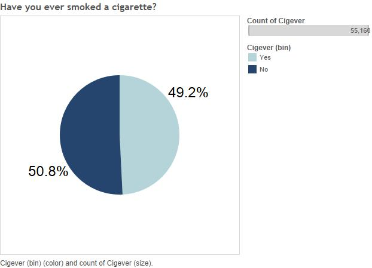

To give an overview of tobacco usage among the respondents, here are the percentages of respondents who have and have not smoked a cigarette in their lives. 

####Frequency

In addition to the percentage of respondents who have smoked, it is also good to know how much each individual is likely to smoke. 

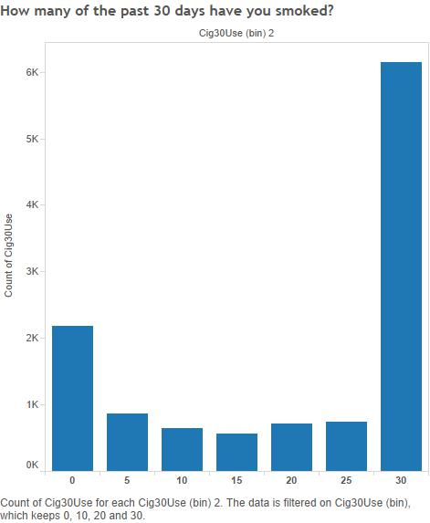

The greatest value by far is 30 days, indicating smoking on all of the last 30 days. This graph is shocking, but recall that this only includes respondents who have used cigarettes and who have used cigarettes in the past 30 days. Among all respondents, 11.1% smoked all of the past 30 days, but among all respondents who have smoked at all in the past 30 days, 51.5% smoked all 30 days.

####Peers

One important aspect of life that is affected by tobacco use in many ways is a person's connections with their friends and family, so it is important to study what those ways might be. 


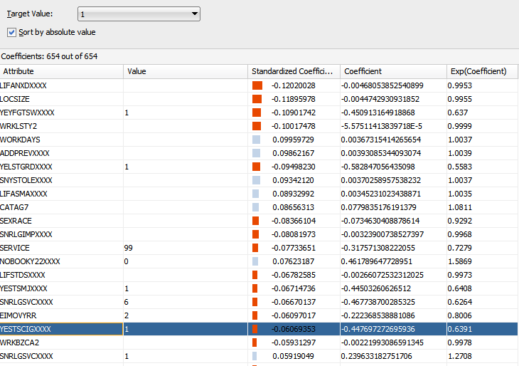

When running a classification analysis on the data to predict factors affecting cigarette usage, YESTSCIG was one of the top confidence attributes and deals with the amount of respondents' peers who smoke cigarettes. 


```{r, echo=FALSE}
cigever <- data.frame(eval(parse(text=substring(getURL(URLencode('http://129.152.144.84:5001/rest/native/?query="select rid, cigever from core_substance"'), httpheader=c(DB='jdbc:oracle:thin:@129.152.144.84:1521/PDB1.usuniversi01134.oraclecloud.internal', USER='cs370_jls6673', PASS='orcl', MODE='native_mode', MODEL='model', returnFor = 'R', returnDimensions = 'False'), verbose = TRUE), 1, 2^31-1))))

yestscigxxxx <- data.frame(eval(parse(text=substring(getURL(URLencode('http://129.152.144.84:5001/rest/native/?query="select ridxxxx as rid, yestscigxxxx from non_core"'), httpheader=c(DB='jdbc:oracle:thin:@129.152.144.84:1521/PDB1.usuniversi01134.oraclecloud.internal', USER='cs370_jls6673', PASS='orcl', MODE='native_mode', MODEL='model', returnFor = 'R', returnDimensions = 'False'), verbose = TRUE), 1, 2^31-1))))

merged<-merge(cigever, yestscigxxxx)
thesubset<-subset(merged, YESTSCIGXXXX<5 & CIGEVER<3)

ggplot(thesubset, aes(x=YESTSCIGXXXX, fill=as.factor(CIGEVER)))+geom_bar()+labs(title="# of cigarette smoking peers colored by ever smoked cigarette", y="Count")+xlim("1" = "None","2" = "A few", "3" = "Most","4" = "All")+scale_fill_discrete(name="Ever had cigarette", breaks=c("1", "2"), labels=c("Yes", "No"))+xlab("Amount of peers who smoke cigarettes")

```

We can roughly see that as more of the respondent's peers smoke, the more likely the respondent is to smoke as well, but the lengths of the bars makes it difficult to be sure. 

```{r, echo=FALSE}
nums<-c(nrow(subset(thesubset, CIGEVER==1 & YESTSCIGXXXX==1))/nrow(subset(thesubset, YESTSCIGXXXX==1)), nrow(subset(thesubset, CIGEVER==1 & YESTSCIGXXXX==2))/nrow(subset(thesubset, YESTSCIGXXXX==2)), nrow(subset(thesubset, CIGEVER==1 & YESTSCIGXXXX==3))/nrow(subset(thesubset, YESTSCIGXXXX==3)), nrow(subset(thesubset, CIGEVER==1 & YESTSCIGXXXX==4))/nrow(subset(thesubset, YESTSCIGXXXX==4)))

qplot(seq_along(nums), nums, size=I(5), ylim=c(0,1),main="Proportion of levels of amount of smoking peers that've had a cigarette", xlab="Amount of respondent's peers who smoke cigarettes", ylab="Proportion of respondents who have smoked a cigarette") + scale_x_continuous(breaks=c(1, 2, 3, 4), labels=c("None", "A few", "Most", "All"))+ geom_smooth(se=FALSE, method="lm")
```

Whenever proportions are graphed in this report, the y-axis will include the full scale of possible values from 0 to 1 so that the results do not appear exaggerated. Also consider the large sample size of 55,000+ which means that even small differences in proportions are quite significant. Now we can see that there is a clear correlation with the amount of the respondent's peers who smoke cigarettes and the likelihood that the respondent themself has smoked a cigarette as there is a .413 difference in proportions from no peers smoking cigarettes and all peers smoking cigarettes. This is an important point because it provides good support for the idea that "peer pressure" leads many teens to experiment with cigarettes. 

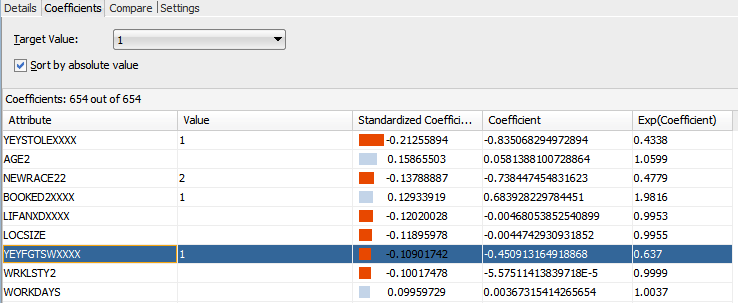

In the same algorithm's output was a higher confidence attribute, YEYFGTSW (amount of fights the repsondent has gotten into at school or work), for predicting cigarette use.

```{r, echo=FALSE}
yeyfgtsw <- data.frame(eval(parse(text=substring(getURL(URLencode('http://129.152.144.84:5001/rest/native/?query="select ridxxxx as rid, yeyfgtswxxxx as yeyfgtsw from non_core"'), httpheader=c(DB='jdbc:oracle:thin:@129.152.144.84:1521/PDB1.usuniversi01134.oraclecloud.internal', USER='cs370_jls6673', PASS='orcl', MODE='native_mode', MODEL='model', returnFor = 'R', returnDimensions = 'False'), verbose = TRUE), 1, 2^31-1))))

cigever <- data.frame(eval(parse(text=substring(getURL(URLencode('http://129.152.144.84:5001/rest/native/?query="select rid, cigever from core_substance"'), httpheader=c(DB='jdbc:oracle:thin:@129.152.144.84:1521/PDB1.usuniversi01134.oraclecloud.internal', USER='cs370_jls6673', PASS='orcl', MODE='native_mode', MODEL='model', returnFor = 'R', returnDimensions = 'False'), verbose = TRUE), 1, 2^31-1))))

merged<-merge(cigever, yeyfgtsw)
thesubset<-subset(merged, YEYFGTSW<6 & CIGEVER<3)

ggplot(thesubset, aes(x=YEYFGTSW, fill=as.factor(CIGEVER)))+geom_bar()+labs(title="Count of serious fights at school/work by ever smoked cigarette", y="Count")+xlim("1" = "0","2" = "1 or 2", "3" = "3 to 5","4" = "6 to 9", "5" = "10 or more")+scale_fill_discrete(name="Ever had cigarette", breaks=c("1", "2"), labels=c("Yes", "No"))+xlab("Number of serious fights at school/work")


```

Again, it is difficult to read the graph so we will look at the proportions again. The bars are only included to get a sense of the number of responses for each choice. 

```{r, echo=FALSE}
nums<-c(nrow(subset(thesubset, CIGEVER==1 & YEYFGTSW==1))/nrow(subset(thesubset, YEYFGTSW==1)), nrow(subset(thesubset, CIGEVER==1 & YEYFGTSW==2))/nrow(subset(thesubset, YEYFGTSW==2)), nrow(subset(thesubset, CIGEVER==1 & YEYFGTSW==3))/nrow(subset(thesubset, YEYFGTSW==3)), nrow(subset(thesubset, CIGEVER==1 & YEYFGTSW==4))/nrow(subset(thesubset, YEYFGTSW==4)), nrow(subset(thesubset, CIGEVER==1 & YEYFGTSW==5))/nrow(subset(thesubset, YEYFGTSW==5)))

qplot(seq_along(nums), nums, size=I(5), ylim=c(0,1),main="Proportion of levels of serious fights at school/work that've had a cigarette", xlab="Number of serious fights at school/work", ylab="Proportion of respondents who have smoked a cigarette") + scale_x_continuous(breaks=c(1, 2, 3, 4, 5), labels=c("0", "1 or 2", "3 to 5", "6 to 9", "10 or more"))
```

Again we see a linear relationship that suggests that violence is associated with cigarette usage with a difference in proportions from 0 fights to 6-9 fights of .29. This could be explained by several different factors including irritability resulting from periods of nicotine withdrawal, or perhaps an external factor is responsible for both smoking and violence. Notice that the bin for 10 fights and over is an open interval on the right so any number of fights above 10 is included here, which may be the cause of the lower proportion of respondents who have smoked for that bin. 


####Tobacco vs Alcohol

Numerous data mining algorithms suggested a connection between the earlier age a respondent has their first drink and whether or not they have tried a cigarette before, we investigate this by looking at age of first use of alcohol colored by cigarette usage. 


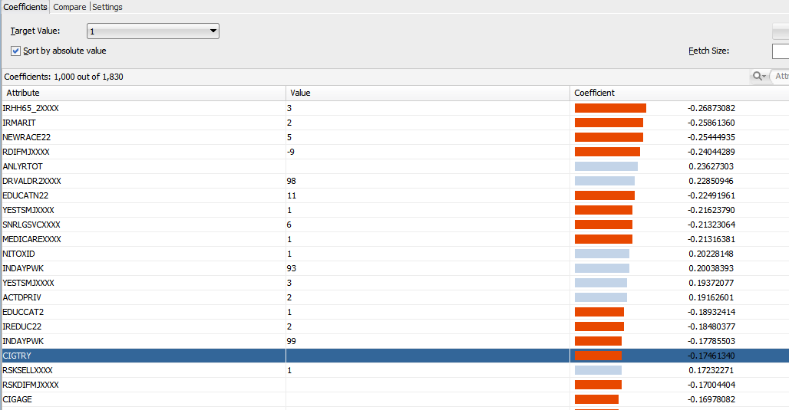

When predicting if a respondent has ever used marijuana using classification algorithms, CIGTRY and ALCTRY, age of first use of cigarettes and alcohol, were high confidence predictors of marijuana use the lower their values were. 


```{r, echo=FALSE}
alccig <- data.frame(eval(parse(text=substring(getURL(URLencode('http://129.152.144.84:5001/rest/native/?query="select rid, cigever, alctry from core_substance"'), httpheader=c(DB='jdbc:oracle:thin:@129.152.144.84:1521/PDB1.usuniversi01134.oraclecloud.internal', USER='cs370_jls6673', PASS='orcl', MODE='native_mode', MODEL='model', returnFor = 'R', returnDimensions = 'False'), verbose = TRUE), 1, 2^31-1))))

thesubset<-subset(alccig, CIGEVER<3 & ALCTRY<76)

thesubset$ALCTRY<-cut(thesubset$ALCTRY, c(1, 6, 11, 16, 21, 26, 31, 36, 41, 46, 51, 56, 61, 66, 71), labels=FALSE, include.lowest=TRUE, right=FALSE)

ggplot(thesubset, aes(x=ALCTRY, fill=as.factor(CIGEVER)))+geom_bar()+labs(title="Age of first use of alcohol colored by ever had cigarette", y="Count")+scale_x_discrete("Age respondent first tried alcohol", labels = c("1" = "1","2" = "6", "3" = "11","4" = "16", "5" = "21", "6" = "26", "7" = "31", "8" = "36", "9" = "41", "10" = "46", "11" = "51", "12" = "56", "13" = "61", "14" = "66", "15" = "71"))+scale_fill_discrete(name="Ever had cigarette", breaks=c("1", "2"), labels=c("Yes", "No"))+geom_vline(xintercept=4.5)

```

Note that the legal drinking age is represented by a vertical line. Now we examine the proportions of each level of alcohol first use that have smoked a cigarette. 

```{r, echo=FALSE}
nums<-c(nrow(subset(thesubset, CIGEVER==1 & ALCTRY==1))/nrow(subset(thesubset, ALCTRY==1)), nrow(subset(thesubset, CIGEVER==1 & ALCTRY==2))/nrow(subset(thesubset, ALCTRY==2)), nrow(subset(thesubset, CIGEVER==1 & ALCTRY==3))/nrow(subset(thesubset, ALCTRY==3)), nrow(subset(thesubset, CIGEVER==1 & ALCTRY==4))/nrow(subset(thesubset, ALCTRY==4)), nrow(subset(thesubset, CIGEVER==1 & ALCTRY==5))/nrow(subset(thesubset, ALCTRY==5)), nrow(subset(thesubset, CIGEVER==1 & ALCTRY==6))/nrow(subset(thesubset, ALCTRY==6)), nrow(subset(thesubset, CIGEVER==1 & ALCTRY==7))/nrow(subset(thesubset, ALCTRY==7)))

qplot(seq_along(nums), nums, size=I(5), ylim=c(0,1), main="Proportions of ages of first alcohol use that have had a cigarette", xlab="Age respondent first tried alcohol", ylab="Proportion of respondents who have smoked a cigarette") + scale_x_continuous(breaks=c(1, 2, 3, 4, 5, 6, 7), labels=c("1", "6", "11", "16", "21", "26", "31"))+geom_vline(xintercept=5)
```

For 6 to 30 year olds the intuition of earlier alcohol use occuring with higher cigarette usage seems to hold up and includes a difference in proportions between the 6 and 26-30 year olds of .36, but those who were 1 to 5 or 31 to 36 years old for their first drink seem to have an unusually low and high (respectively) proportion of respondents who have smoked before compared to the other levels of age. Note that ages above 31 to 36 are not shown because there are not enough samples. 


The data mining process also suggested that early alcohol and cigarette usage predict marijuana usage.

```{r, echo=FALSE}
alccigmj <- data.frame(eval(parse(text=substring(getURL(URLencode('http://129.152.144.84:5001/rest/native/?query="select rid, cigtry, alctry, mjever from core_substance"'), httpheader=c(DB='jdbc:oracle:thin:@129.152.144.84:1521/PDB1.usuniversi01134.oraclecloud.internal', USER='cs370_jls6673', PASS='orcl', MODE='native_mode', MODEL='model', returnFor = 'R', returnDimensions = 'False'), verbose = TRUE), 1, 2^31-1))))

thesubset<-subset(alccigmj, CIGTRY<63 & ALCTRY<63 & MJEVER<3)

thesubset$MJEVER<-replace(thesubset$MJEVER, thesubset$MJEVER==1, "Have used marijuana")
thesubset$MJEVER<-replace(thesubset$MJEVER, thesubset$MJEVER==2, "Have not used marijuana")

ggplot(thesubset, aes(x=ALCTRY, y=CIGTRY, colour=as.factor(MJEVER)))+geom_point(shape=19, alpha=.5, size=2, position=position_jitter(width=1.5,height=.75))+labs(title="Age of first alcohol use vs age of first cigarette use", y="Age of first cigarette use")+scale_x_discrete("Age of first alcohol use", breaks=c("10", "20", "30", "40", "50", "60", "70"))+scale_fill_discrete(name="Ever used marijuana", breaks=c("1", "2"), labels=c("Yes", "No"))+ geom_vline(xintercept = 21) + geom_hline(yintercept=18)

```

Note that red points indicate the respondent has used marijuana before, and overplotting due to the 55,000+ samples was treated by making points slightly transparent (so large amounts of points together become more opaque) and by "jittering" (or offsetting points from one another so they do not cover one another) the points. Additionally, the legal drinking age is represented by a vertical line and the legal smoking age is represented by a horizontal line. These lines show that premature alcohol use is more associated with marijuana use than premature cigarette use because the blue points cross the cigarette line more often than the alcohol line. When looking at age of first use of alcohol vs cigarettes colored by marijuana use, there is some support for the idea that early cigarette and alcohol use is correlated with marijuana use. 

###Marijuana

As it is the most popular illicit recreational drug and is becoming legalized in many places, it is also important to study marijuana use among respondents.

####Health

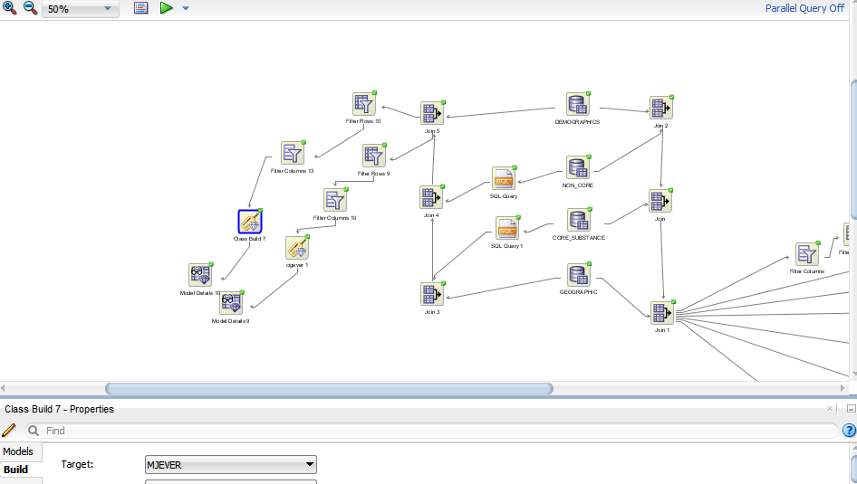

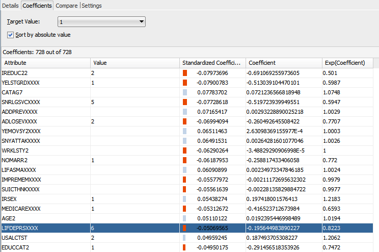

The classification algorithms for prediciting marijuana use included a high confidence attribute LIFDEPRS, if the respondent has ever had depression.

```{r, echo=FALSE}
lif <- data.frame(eval(parse(text=substring(getURL(URLencode('http://129.152.144.84:5001/rest/native/?query="select ridxxxx as rid, lifdeprsxxxx as lifdeprs from non_core"'), httpheader=c(DB='jdbc:oracle:thin:@129.152.144.84:1521/PDB1.usuniversi01134.oraclecloud.internal', USER='cs370_jls6673', PASS='orcl', MODE='native_mode', MODEL='model', returnFor = 'R', returnDimensions = 'False'), verbose = TRUE), 1, 2^31-1))))

mj <- data.frame(eval(parse(text=substring(getURL(URLencode('http://129.152.144.84:5001/rest/native/?query="select rid, mjever from core_substance"'), httpheader=c(DB='jdbc:oracle:thin:@129.152.144.84:1521/PDB1.usuniversi01134.oraclecloud.internal', USER='cs370_jls6673', PASS='orcl', MODE='native_mode', MODEL='model', returnFor = 'R', returnDimensions = 'False'), verbose = TRUE), 1, 2^31-1))))

merged<-merge(lif, mj)
thesubset<-subset(merged, LIFDEPRS<7 & MJEVER<3)

thesubset$LIFDEPRS<-replace(thesubset$LIFDEPRS, thesubset$LIFDEPRS==6, 2)

ggplot(thesubset, aes(x=LIFDEPRS, fill=as.factor(MJEVER)))+geom_bar()+labs(title="Ever had depression colored by ever used marijuana", y="Count")+xlim("1"="Yes", "2"="No")+scale_fill_discrete(name="Ever used marijuana", breaks=c("1", "2"), labels=c("Yes", "No")) +xlab("Ever had depression")


```

```{r, echo=FALSE}
nums<-c(nrow(subset(thesubset, MJEVER==1 & LIFDEPRS==1))/nrow(subset(thesubset, LIFDEPRS==1)), nrow(subset(thesubset, MJEVER==1 & LIFDEPRS==2))/nrow(subset(thesubset, LIFDEPRS==2)))

barplot(nums, ylim=c(0,1), ylab = "Proportion of respondents who have used marijuana", xlab="Ever had depression", names.arg=c("Yes", "No"), main="Proportion of each level of depression that have used marijuana")

```

Since there are only two values it is hard to get a sense of whether this result is significant, but after a two proportion z-test (with n1=6117, n2=17970, y1=3852, y2=7563, p^1=.6297, p^2=.4209) with a difference in proportions of .21, a p-value of <.00001 was returned which tells us that there is strong evidence that depression and marijuana use occur together. Whether a person is depressed and seeks out marijuana to treat the depression or whether a marijuana user becomes depressed after using the drug is difficult to tell from our data, however. But there is research that suggests that marijuana is helpful in treating depression and many patients use it for such purposes.

####Peers

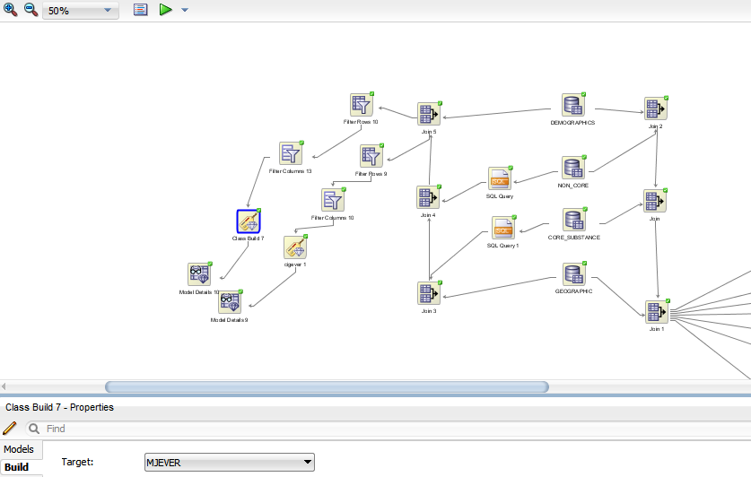

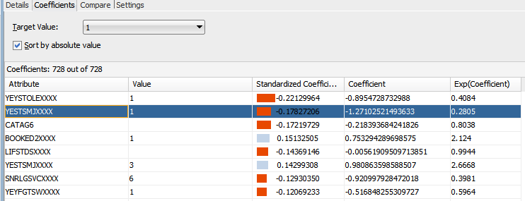

The influence of a respondent's peers was also evident in the classification algorithm output for predicting marijuana use as well. In fact, peers' marijuana usage, YESTSMJ, was the second highest confidence predictor for a respondent's marijuana use.


```{r, echo=FALSE}
mj <- data.frame(eval(parse(text=substring(getURL(URLencode('http://129.152.144.84:5001/rest/native/?query="select rid, mjever from core_substance"'), httpheader=c(DB='jdbc:oracle:thin:@129.152.144.84:1521/PDB1.usuniversi01134.oraclecloud.internal', USER='cs370_jls6673', PASS='orcl', MODE='native_mode', MODEL='model', returnFor = 'R', returnDimensions = 'False'), verbose = TRUE), 1, 2^31-1))))

yest <- data.frame(eval(parse(text=substring(getURL(URLencode('http://129.152.144.84:5001/rest/native/?query="select ridxxxx as rid, yestsmjxxxx as yestsmj from non_core"'), httpheader=c(DB='jdbc:oracle:thin:@129.152.144.84:1521/PDB1.usuniversi01134.oraclecloud.internal', USER='cs370_jls6673', PASS='orcl', MODE='native_mode', MODEL='model', returnFor = 'R', returnDimensions = 'False'), verbose = TRUE), 1, 2^31-1))))

merged<-merge(mj, yest)
thesubset<-subset(merged, YESTSMJ<5 & MJEVER<3)

ggplot(thesubset, aes(x=YESTSMJ, fill=as.factor(MJEVER)))+geom_bar()+labs(title="# of marijuana smoking peers colored by ever smoked marijuana", y="Count")+xlim("1" = "None","2" = "A few", "3" = "Most","4" = "All")+scale_fill_discrete(name="Ever used marijuana", breaks=c("1", "2"), labels=c("Yes", "No"))+xlab("Amount of peers who smoke marijuana")

```

We can clearly see that as more of the respondent's peers use marijuana, the more likely the respondent is to use marijuana as well.

```{r, echo=FALSE}
nums<-c(nrow(subset(thesubset, MJEVER==1 & YESTSMJ==1))/nrow(subset(thesubset, YESTSMJ==1)), nrow(subset(thesubset, MJEVER==1 & YESTSMJ==2))/nrow(subset(thesubset, YESTSMJ==2)), nrow(subset(thesubset, MJEVER==1 & YESTSMJ==3))/nrow(subset(thesubset, YESTSMJ==3)), nrow(subset(thesubset, MJEVER==1 & YESTSMJ==4))/nrow(subset(thesubset, YESTSMJ==4)))

qplot(seq_along(nums), nums, ylim=c(0,1), size=I(5), main="Proportion of levels of # of marijuana using peers that have used marijuana", xlab="Amount of respondent's peers who use marijuana", ylab="Proportion of respondents who have used marijuana") + scale_x_continuous(breaks=c(1, 2, 3, 4), labels=c("None", "A few", "Most", "All"))+ geom_smooth(se=FALSE, method="lm")
```

The proportion graph reinforces the idea that people use marijuana more often the more their peers do. This is even clearer here in the case of marijuana than it is in the case of cigarettes as the proportions increase linearly all the way up to .6 as opposed to .46 with cigarettes. 

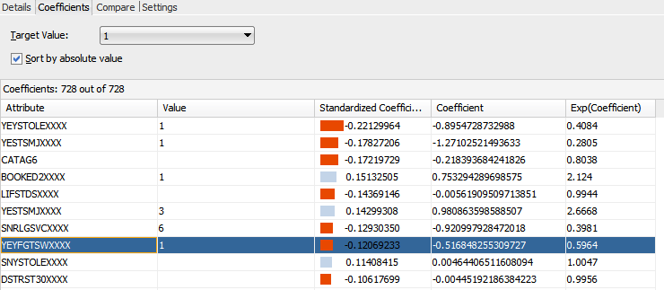

YEYFGTSW, amount of fights the repsondent has gotten into at school or work was also a high confidence predictor for marijuana use. 

```{r, echo=FALSE}
yey <- data.frame(eval(parse(text=substring(getURL(URLencode('http://129.152.144.84:5001/rest/native/?query="select ridxxxx as rid, yeyfgtswxxxx as yeyfgtsw from non_core"'), httpheader=c(DB='jdbc:oracle:thin:@129.152.144.84:1521/PDB1.usuniversi01134.oraclecloud.internal', USER='cs370_jls6673', PASS='orcl', MODE='native_mode', MODEL='model', returnFor = 'R', returnDimensions = 'False'), verbose = TRUE), 1, 2^31-1))))

mj <- data.frame(eval(parse(text=substring(getURL(URLencode('http://129.152.144.84:5001/rest/native/?query="select rid, mjever from core_substance"'), httpheader=c(DB='jdbc:oracle:thin:@129.152.144.84:1521/PDB1.usuniversi01134.oraclecloud.internal', USER='cs370_jls6673', PASS='orcl', MODE='native_mode', MODEL='model', returnFor = 'R', returnDimensions = 'False'), verbose = TRUE), 1, 2^31-1))))

merged<-merge(yey, mj)
thesubset<-subset(merged, YEYFGTSW<6 & MJEVER<3)

ggplot(thesubset, aes(x=YEYFGTSW, fill=as.factor(MJEVER)))+geom_bar()+labs(title="Counts of serious fights at school/work by ever used marijuana", y="Count")+xlim("1" = "0","2" = "1 or 2", "3" = "3 to 5","4" = "6 to 9", "5" = "10 or more")+scale_fill_discrete(name="Ever used marijuana", breaks=c("1", "2"), labels=c("Yes", "No"))+xlab("Number of serious fights at school/work")


```


```{r, echo=FALSE}
nums<-c(nrow(subset(thesubset, MJEVER==1 & YEYFGTSW==1))/nrow(subset(thesubset, YEYFGTSW==1)), nrow(subset(thesubset, MJEVER==1 & YEYFGTSW==2))/nrow(subset(thesubset, YEYFGTSW==2)), nrow(subset(thesubset, MJEVER==1 & YEYFGTSW==3))/nrow(subset(thesubset, YEYFGTSW==3)), nrow(subset(thesubset, MJEVER==1 & YEYFGTSW==4))/nrow(subset(thesubset, YEYFGTSW==4)), nrow(subset(thesubset, MJEVER==1 & YEYFGTSW==5))/nrow(subset(thesubset, YEYFGTSW==5)))

qplot(seq_along(nums), nums, size=I(5), ylim=c(0,1), main="Proportion of levels of serious fights at school/work that've used marijuana", xlab="Number of serious fights at school/work", ylab="Proportion of respondents who have used marijuana") + scale_x_continuous(breaks=c(1, 2, 3, 4, 5), labels=c("0", "1 or 2", "3 to 5", "6 to 9", "10 or more"))
```

This is very similar to the results of the same analysis with cigarette use, except that the proportion of marijuana users who have been in 10+ fights is a bit higher than the proportion of cigarette users in the same bin. There is a difference in proportions of .26 between those who have never been in fights and those who have been in 10+.

####Age

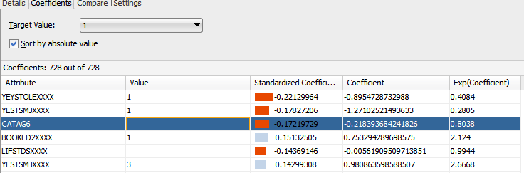

Age in 6 intervals, CATAG6, was also one of the highest confidence predictors for marijuana use and alcohol use by age is also included as reference.

```{r, echo=FALSE}
mj <- data.frame(eval(parse(text=substring(getURL(URLencode('http://129.152.144.84:5001/rest/native/?query="select rid, mjever, alcever from core_substance"'), httpheader=c(DB='jdbc:oracle:thin:@129.152.144.84:1521/PDB1.usuniversi01134.oraclecloud.internal', USER='cs370_jls6673', PASS='orcl', MODE='native_mode', MODEL='model', returnFor = 'R', returnDimensions = 'False'), verbose = TRUE), 1, 2^31-1))))

cat <- data.frame(eval(parse(text=substring(getURL(URLencode('http://129.152.144.84:5001/rest/native/?query="select rid, catag6 from demographics"'), httpheader=c(DB='jdbc:oracle:thin:@129.152.144.84:1521/PDB1.usuniversi01134.oraclecloud.internal', USER='cs370_jls6673', PASS='orcl', MODE='native_mode', MODEL='model', returnFor = 'R', returnDimensions = 'False'), verbose = TRUE), 1, 2^31-1))))

merged<-merge(mj, cat)
thesubset<-subset(merged, MJEVER<3 & ALCEVER<3)

ggplot(thesubset, aes(x=CATAG6, fill=as.factor(MJEVER)))+geom_bar(width=.5)+labs(title="Age colored by ever used marijuana", y="Count")+xlim("1" = "12","2" = "18", "3" = "26","4" = "35", "5" = "50", "6"="65+")+scale_fill_discrete(name="Ever used marijuana", breaks=c("1", "2"), labels=c("Yes", "No"))+xlab("Age")

ggplot(thesubset, aes(x=CATAG6, fill=as.factor(ALCEVER)))+geom_bar(width=.5)+labs(title="Age colored by ever used alcohol", y="Count")+xlim("1" = "12","2" = "18", "3" = "26","4" = "35", "5" = "50", "6"="65+")+scale_fill_discrete(name="Ever used alcohol", breaks=c("1", "2"), labels=c("Yes", "No"))+xlab("Age")


nums<-c(nrow(subset(thesubset, MJEVER==1 & CATAG6==1))/nrow(subset(thesubset, CATAG6==1)), nrow(subset(thesubset, ALCEVER==1 & CATAG6==1))/nrow(subset(thesubset, CATAG6==1)), nrow(subset(thesubset, MJEVER==1 & CATAG6==2))/nrow(subset(thesubset, CATAG6==2)),nrow(subset(thesubset, ALCEVER==1 & CATAG6==2))/nrow(subset(thesubset, CATAG6==2)),nrow(subset(thesubset, MJEVER==1 & CATAG6==3))/nrow(subset(thesubset, CATAG6==3)),nrow(subset(thesubset, ALCEVER==1 & CATAG6==3))/nrow(subset(thesubset, CATAG6==3)),nrow(subset(thesubset, MJEVER==1 & CATAG6==4))/nrow(subset(thesubset, CATAG6==4)),nrow(subset(thesubset, ALCEVER==1 & CATAG6==4))/nrow(subset(thesubset, CATAG6==4)),nrow(subset(thesubset, MJEVER==1 & CATAG6==5))/nrow(subset(thesubset, CATAG6==5)),nrow(subset(thesubset, ALCEVER==1 & CATAG6==5))/nrow(subset(thesubset, CATAG6==5)),nrow(subset(thesubset, MJEVER==1 & CATAG6==6))/nrow(subset(thesubset, CATAG6==6)),nrow(subset(thesubset, ALCEVER==1 & CATAG6==6))/nrow(subset(thesubset, CATAG6==6)))   

ages<-c(1,1,2, 2,3, 3,4, 4,5, 5,6, 6)
substance<-c("M", "A", "M", "A", "M", "A", "M", "A", "M", "A", "M", "A")

thedf<-data.frame(ages,nums, substance)

ggplot(data=thedf, aes(x=ages, y=nums, group=substance, colour=substance)) + geom_line(size=1.5) + geom_point(size=3, fill="white") + scale_shape_manual(values=c(22,21))+labs(title="Proportion of marijuana and alcohol users by age", y="Propotion of users")+scale_x_discrete("Age", labels = c("1" = "12","2" = "18", "3" = "26","4" = "35", "5" = "50", "6"="65+"))+scale_fill_discrete(name="Substance", breaks=c("1", "2"), labels=c("Alcohol", "Marijuana"))
```

Especially when looking at the first and last age categories (12-17 and 51-65+) we can see that the gap between alcohol and marijuana use due to legality is shrinking as time goes on. For the 12-17 age group there is a difference of .1 between the proportions while the 51-65+ age group has a difference of .6. This may be explained by marijuana legalization and the increase of its use for its medicinal properties. It should also be noted that both drugs rise at the same rate and stay relatively level for most ages but once the 60's are considered marijuana drops to the level of use of 12 year olds while alcohol remains steady or drops a tiny bit. So regardless of marijuana's reported benefits as a medicine, the 60+ population uses much less marijuana than alcohol. 

####Religion

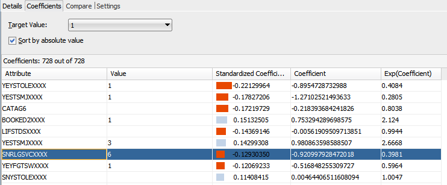

Number of religious services the respondent has attended in the past year, SNRLGSVC, was also a high confidence predictor for marijuana usage.

```{r, echo=FALSE}
snr <- data.frame(eval(parse(text=substring(getURL(URLencode('http://129.152.144.84:5001/rest/native/?query="select ridxxxx as rid, snrlgsvcxxxx as snrlgsvc from non_core"'), httpheader=c(DB='jdbc:oracle:thin:@129.152.144.84:1521/PDB1.usuniversi01134.oraclecloud.internal', USER='cs370_jls6673', PASS='orcl', MODE='native_mode', MODEL='model', returnFor = 'R', returnDimensions = 'False'), verbose = TRUE), 1, 2^31-1))))

mj <- data.frame(eval(parse(text=substring(getURL(URLencode('http://129.152.144.84:5001/rest/native/?query="select rid, mjever from core_substance"'), httpheader=c(DB='jdbc:oracle:thin:@129.152.144.84:1521/PDB1.usuniversi01134.oraclecloud.internal', USER='cs370_jls6673', PASS='orcl', MODE='native_mode', MODEL='model', returnFor = 'R', returnDimensions = 'False'), verbose = TRUE), 1, 2^31-1))))

merged<-merge(mj, snr)
thesubset<-subset(merged, SNRLGSVC<7 & MJEVER<3)

ggplot(thesubset, aes(x=SNRLGSVC, fill=as.factor(MJEVER)))+geom_bar()+labs(title="# of religious services attended in past year by marijuana use", y="Count")+xlim("1" = "0","2" = "1", "3" = "3","4" = "6", "5" = "25", "6" = "52+")+scale_fill_discrete(name="Ever used marijuana", breaks=c("1", "2"), labels=c("Yes", "No"))+xlab("# of religious services attended in past year")

```


```{r, echo=FALSE}
nums<-c(nrow(subset(thesubset, MJEVER==1 & SNRLGSVC==1))/nrow(subset(thesubset, SNRLGSVC==1)), nrow(subset(thesubset, MJEVER==1 & SNRLGSVC==2))/nrow(subset(thesubset, SNRLGSVC==2)), nrow(subset(thesubset, MJEVER==1 & SNRLGSVC==3))/nrow(subset(thesubset, SNRLGSVC==3)), nrow(subset(thesubset, MJEVER==1 & SNRLGSVC==4))/nrow(subset(thesubset, SNRLGSVC==4)), nrow(subset(thesubset, MJEVER==1 & SNRLGSVC==5))/nrow(subset(thesubset, SNRLGSVC==5)), nrow(subset(thesubset, MJEVER==1 & SNRLGSVC==6))/nrow(subset(thesubset, SNRLGSVC==6)))

qplot(seq_along(nums), nums, size=I(5), ylim=c(0,1),main="Proportion of each level of religious attendance that have used marijuana", xlab="# of religious services attended in past year", ylab="Proportion of respondents who have used marijuana") + scale_x_continuous(breaks=c(1, 2, 3, 4, 5, 6), labels=c("0", "1", "3", "6", "25", "52+"))+ geom_smooth(se=FALSE, method="lm")
```

The decrease in proportions of .299 from 0 religious services to 25+ religious services is quite high and is evidence that the more religious a person is, the less likely they are to use marijuana.

###Heroin Oxycontin

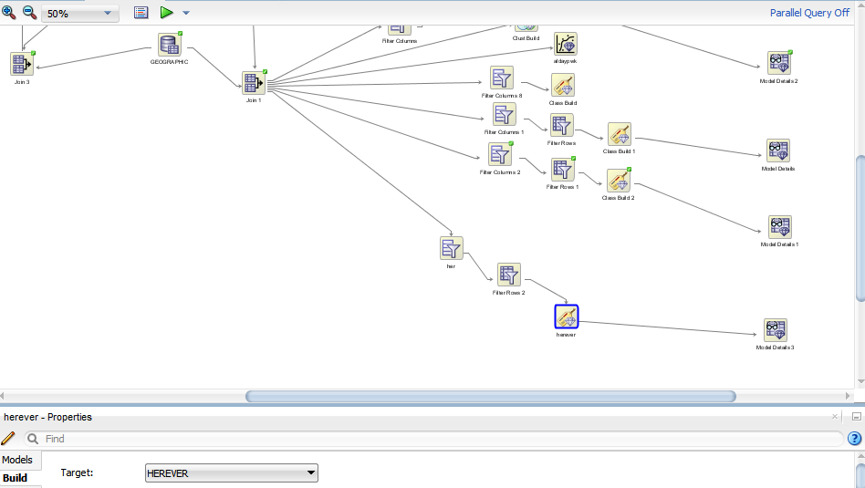

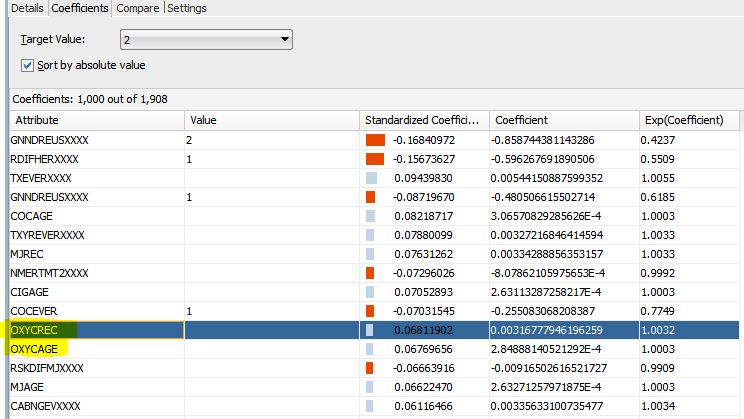

An alarming connection was also discovered between use of the narcotic, opioid (opiate-like) painkiller Oxycontin that is often prescribed after surgery and heroin use. When using classification algorithms to predict heroin usage, oxycontin related variables showed up near the top with the highest confidence variables. 

```{r, echo=FALSE}
oxy <- data.frame(eval(parse(text=substring(getURL(URLencode('http://129.152.144.84:5001/rest/native/?query="select rid, oxycrec, herever from core_substance"'), httpheader=c(DB='jdbc:oracle:thin:@129.152.144.84:1521/PDB1.usuniversi01134.oraclecloud.internal', USER='cs370_jls6673', PASS='orcl', MODE='native_mode', MODEL='model', returnFor = 'R', returnDimensions = 'False'), verbose = TRUE), 1, 2^31-1))))

thesubset<-subset(oxy, OXYCREC==1|OXYCREC==2|OXYCREC==3|OXYCREC==91&HEREVER<3)

thesubset$OXYCREC<-replace(thesubset$OXYCREC, thesubset$OXYCREC==91, 4)

ggplot(thesubset, aes(x=OXYCREC, fill=as.factor(HEREVER)))+geom_bar()+labs(title="Recency of oxycontin use by ever used heroin", y="Count")+xlim("1" = "<30dys","2" = ">30dys, <1yr", "3" = ">1yr","4" = "Never used")+scale_fill_discrete(name="Ever used heroin", breaks=c("1", "2"), labels=c("Yes", "No"))+xlab("Last oxycontin use")

```

First bargraph only included for scale. 

```{r, echo=FALSE}
nums<-c(nrow(subset(thesubset, HEREVER==1 & OXYCREC==1))/nrow(subset(thesubset, OXYCREC==1)), nrow(subset(thesubset, HEREVER==1 & OXYCREC==2))/nrow(subset(thesubset, OXYCREC==2)), nrow(subset(thesubset, HEREVER==1 & OXYCREC==3))/nrow(subset(thesubset, OXYCREC==3)), nrow(subset(thesubset, HEREVER==1 & OXYCREC==4))/nrow(subset(thesubset, OXYCREC==4)))

barplot(nums, ylim=c(0,1), main="Proportion of each level of oxycontin recency that have used heroin", xlab="Recency of oxycontin use", ylab="Proportion of respondents who have used heroin", names.arg=c("<30 days", ">30 days, <1 year", ">1 year", "Never used oxycontin")) 
```

As you can see, heroin use among people who have used Oxycontin is much higher than heroin use among those who have never used oxycontin with a difference in proportions of .332 between those who have used oxycontin in the last 30 days and those who have never used oxycontin. This is perhaps largely due to heroin users who choose to use oxycontin due to its similarity to heroin and due to the fact that it is more common in society and exists in many places legally. Another factor though is the correlation working the other way where surgery patients become dependent on their oxycontin prescription and then choose to buy and use heroin illegally after the prescription expires to get the same experience. 